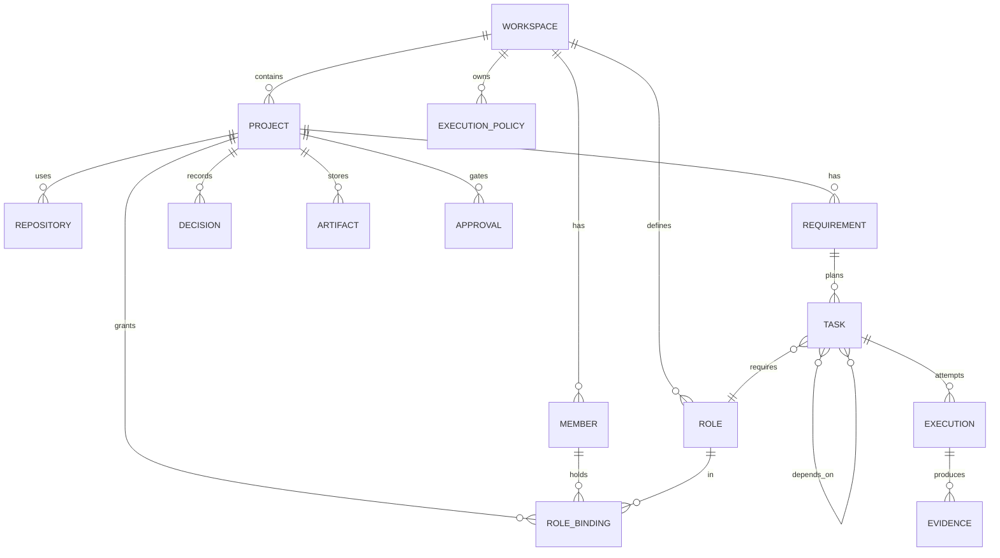

# 领域模型（Stage 0）

代码：`packages/domain/src/entities.ts`。依据：ADR-001。

## 设计规则

1. **纯净**：领域层不依赖 UI、模型厂商、CLI 工具或数据库。这条规则由编译器强制执行：`packages/domain/tsconfig.json` 继承 `"types": []` 且只有 `ES2022` 库，引用 `process` 或 `node:*` 会编译失败（Stage 0 已实测）。
2. **最小字段**：只放 Stage 0 契约需要的字段。后续阶段只加字段，不加概念。
3. **状态只读**：`status` 字段为 `readonly`，只能通过状态机计算（见 `state-machines.md`）。实体以不可变方式更新：`applyTaskEvent()` 返回新对象。
4. **Role ≠ Model**：角色、成员、任务中不出现任何厂商或模型字段。执行器只以不透明的 `ExecutorConfig.id` / `adapter` 字符串出现。

## 实体与归属

| 实体 | 职责 | 关键规则 |
| --- | --- | --- |
| `Workspace` | 一间 AI + 人类办公室 | 拥有执行器配置与**并发配额**（订阅限额按账号计，不按项目）、角色目录、执行策略、办公室配置 |
| `ExecutorConfig` | 一个已配置的执行器实例 | `adapter` 是不透明字符串；密钥只按名称引用，不内联存储 |
| `Project` | 一个项目 | 拥有需求、决策、产出物、任务、审批、质量配置（`QualityProfile`） |
| `QualityProfile` | 任务必须通过的机器检查 | 在 Gate 1 由人确认；为空时任务只能由人验收（见完成规则） |
| `Repository` | 源码位置 | 本地路径、可选远程地址、默认分支、集成分支前缀（`vao/req-`） |
| `Member` | 人或 Agent | 单一抽象，`kind: 'human' \| 'agent'`；不拆分为 Human / Agent 两种类型 |
| `Role` | 一项职责 | 只有权限、说明和可选的 `executionPolicyId`，**没有**模型字段 |
| `RoleBinding` | 成员 × 项目 × 角色 | Agent 不能持有含 `approve` 权限的角色（`assertCanBind()`） |
| `ExecutionPolicy` / `ExecutionRule` | 角色 × 风险等级 → 执行器候选 | 数据而非代码：有序候选、升级阈值、最大尝试次数、预算 |
| `Requirement` | 一条需求 | `rawText` 是人写的原文，永不被分析结果覆盖；结构化分析单独存于 `analysis` |
| `Decision` | 一条项目决策 | 来源：会议、审批或成员；会议纪要以 Decision 保存，不写进用户仓库 |
| `Artifact` | 文件及其派生物 | 三层：`original` / `extracted` / `interpretation`，通过 `parentId` 关联 |
| `Task` | 必须完成的工作 | **不代表某次尝试**；重试与返工属于 Execution；`roleId` 是所需职责，不是执行器 |
| `Execution` | 对任务的一次尝试 | `kind: initial \| retry \| repair`，`attempt` 从 1 开始；记录执行器、实际模型、成本 |
| `Evidence` | 完成的证明（或反证） | `source: machine \| ai \| human`；只有 `machine` 来源的证据计入机器检查 |
| `Approval` | 人的决定 | Agent 可以请求审批，但不能做最终决定（`assertHumanApproval()`） |
| `Event` | 发生过的事实 | 由 `packages/events` 定义（见 `event-contract.md`），领域层不依赖它 |

## 运行时强制的不变量

| 不变量 | 位置 | 测试 |
| --- | --- | --- |
| 只有人能通过 Gate 1 / Gate 2、恢复或验收任务 | `invariants.ts` 的 `assertHumanApproval()`，由状态机调用 | `requirement.spec.ts`、`task-execution.spec.ts` |
| 审批必须针对正确的门与对象 | `assertHumanApproval()`；`applyRequirementEvent()` / `applyTaskEvent()` 检查对象 id | 同上 |
| Agent 不能持有审批角色 | `assertCanBind()` | `completion-invariants.spec.ts` |
| `DONE` 必须有证据 | `evaluateCompletion()` 产生带类型品牌的 `CompletionDecision`；状态机拒绝不引用证据的通过判定 | `task-execution.spec.ts` |

## Stage 0 暂不建模

需求取消、任务优先级、成本汇总、会议实体（会议 = `meeting.*` 事件 + Decision）、多级审批。均为后续阶段按需增加的字段或事件，不改变本模型的概念。
