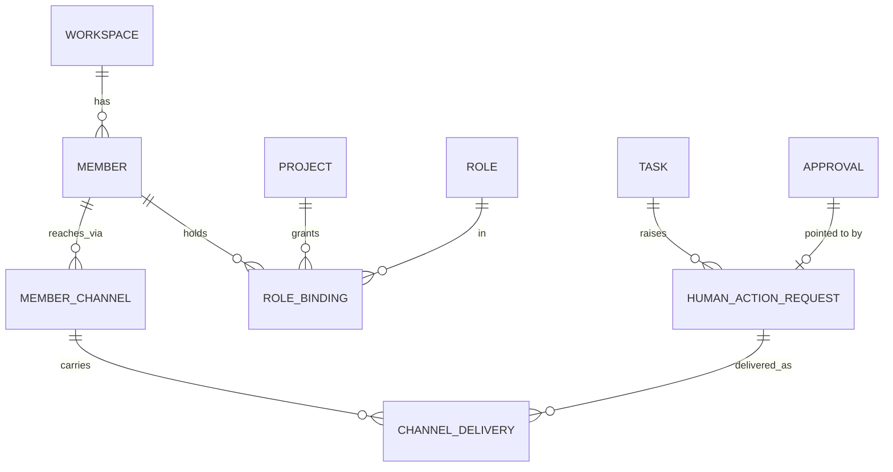

# 人类沟通渠道与 Telegram Human Gateway（Human Channels）

- 状态：**规范冻结（文档）**；不包含任何实现，Telegram 代码属于 Stage 2B
- 产品：Virtual AI Office / 智序工场（命名规则见 `product-identity.md`）
- 依据：ADR-001、`domain-model.md`、`state-machines.md`、`event-contract.md`、`persistence.md`
- 不修改：Stage 1A 执行器、ADR-001、Stage 0 的状态机与不变量（本文引用它们，不改变它们）

## 1. 目标

1. 人类员工与 AI Agent 在**同一个组织模型**里工作：同样的 Workspace、Project、Role、Task、Approval、Event。
2. 人类成员可以通过 Telegram 与 Virtual AI Office 双向沟通：接收任务与审批请求、答复 AI 的提问、主动查询项目状态。
3. Telegram 只是**沟通通道**：它不拥有身份、角色、权限、任务或审批。
4. 所有经 Telegram 发生的操作都经过领域层授权、写入事件日志、可审计。
5. 通道概念保持中立（`MemberChannel`），为未来渠道留出空间，但 V1 只规范 Telegram。

## 2. 非目标

- 不实现任何代码（本文件只冻结架构与产品要求）。
- 不建立独立的 “Telegram 用户 / TelegramUser” 业务模型；不建立 `TelegramTask`、`TelegramApproval`。
- 不让 Telegram 成为无限制的管理控制台：只开放本文定义的命令与按钮。
- 不把 Telegram 聊天记录当作系统状态。
- 不在 V1 规范 WhatsApp、Slack、Email 的细节（只保证模型不阻碍它们）。
- 不推送 Agent 的底层活动（读文件、跑命令、推理过程）。
- 不放进 Stage 1A / 1B。

## 3. 领域模型

沿用 Stage 0 的原则，不新增“人类用户”类型：

```text
Member (kind = human)
   ├── MemberChannel（0..n，每个渠道一条已验证的记录）
   └── RoleBinding（Member × Project × Role）
```



| 概念 | 是领域实体吗 | 说明 |
| --- | --- | --- |
| `Member` / `Role` / `RoleBinding` / `Task` / `Approval` / `Decision` | 是（Stage 0 已有） | 不改变 |
| `MemberChannel` | **是（新增，通道中立）** | 一个人在某渠道上的已验证身份 |
| `HumanActionRequest` | **是（新增，通道中立）** | “系统在等某个/某类人给出答复”的一条持久记录，见 §3.2 |
| `ChannelDelivery` | 基础设施记录 | 一条请求/通知实际发到哪个渠道、哪条消息，用于回复关联与重试 |
| `ChannelLinkCode` | 基础设施记录 | 一次性绑定码（只存哈希） |

以上新增都**不含 Telegram 专有字段**，Telegram 专有数据只出现在 `MemberChannel.externalUserId`、`ChannelDelivery.externalMessageId` 等通道中立字段的取值里。

### 3.1 MemberChannel

```ts
interface MemberChannel {
  id: Id
  workspaceId: Id
  memberId: Id                       // 必须是 kind = 'human' 的 Member
  channel: 'telegram'                // 未来可增加其它值；V1 只有 telegram
  externalUserId: string             // 渠道方的稳定用户标识（Telegram：数字 user id，按字符串存储）
  username?: string                  // 仅作展示，可变，绝不用于身份或授权
  displayName?: string               // 仅作展示
  status: 'active' | 'revoked' | 'unreachable'
  verifiedAt: Timestamp              // 只有验证成功才会创建记录，所以必填
  createdAt: Timestamp
  updatedAt?: Timestamp
}
```

规则：

1. **只有验证成功才创建记录**（见 §6）。因此没有 `pending` 状态；待验证的信息保存在 `ChannelLinkCode`。
2. `memberId` 必须指向 `kind = 'human'` 的成员。Agent 成员**不能**有 MemberChannel（数据库约束 + 领域检查，与现有 “Agent 不能做审批决定” 同构）。
3. 唯一性（**Workspace 范围**）：在**同一个 Workspace 内**，`(workspaceId, channel, externalUserId)` 至多标识一个 `MemberChannel` / 一个 Human Member（概念上 `UNIQUE(workspace_id, channel, external_user_id)`，在 `status = 'active'` 时生效）。一个 Member 可以有多个渠道。**不声明** “一个 Telegram 账号全局只对应一个 Member”：`Member` 本身是 Workspace 范围的，同一个自然人将来可以参与多个 Workspace，在每个 Workspace 中各有自己的 Member 与 MemberChannel。本阶段**不引入全局 Person / User 身份模型**；如果将来需要跨 Workspace 的身份体系，将另行设计。
4. `status`：`active` 可用；`revoked` 被人撤销或成员被移除；`unreachable` 渠道方拒绝投递（例如用户屏蔽了 Bot），不再投递直到用户重新绑定。
5. `username` 与 `displayName` 随时可能变化，**每次收到消息时可以更新展示字段，但不得改变身份映射**。
6. 原始渠道用户 id 属于个人信息：**事件与日志引用 `memberChannelId`，不写原始 `externalUserId`**（见 §15、§16）。

### 3.2 HumanActionRequest（通道中立）

**含义**：一条持久记录，表示 **Virtual AI Office 正在等待某个具体的人类职责 / 动作**。它的方向是“系统 → 人”：命名中的 “Action” 指“需要人采取的动作”，**不是**“由人发起的请求”（人发起的查询见 §12，不产生 HumanActionRequest）。

典型场景：澄清（clarification）、任务验收（task acceptance）、任务指派的响应（assignment response）、业务决策（business decision）、审批（approval）、人工介入（intervention）。

“等人”不能只靠任务状态 `WAITING_HUMAN`：该状态不说明**等谁、等什么、期限、怎么答复**。Stage 2A 增加 `HumanActionRequest`，作为路由、提醒、回复关联和 Virtual Office 展示的**唯一依据**。

```text
Task / Requirement / Approval
   ↓
HumanActionRequest
   ↓ requiredRoleId
Role → RoleBinding → Human Member → MemberChannel → Telegram
```

```ts
interface HumanActionRequest {
  id: Id
  workspaceId: Id
  projectId: Id
  kind: 'clarification' | 'task_acceptance' | 'assignment' | 'decision' | 'approval' | 'intervention'
  subject: { kind: 'requirement' | 'task'; id: Id }
  approvalId?: Id                    // kind = 'approval'：指向已有的 Approval，不复制审批状态
  requiredRoleId?: Id                // 需要承担这项人类职责的角色
  assigneeMemberIds: readonly Id[]   // 当前解析出的人类成员（见 §8、§9）
  declinedByMemberIds: readonly Id[] // 已声明“无法承接”的成员（见 §8.1）
  prompt: string                     // 给人看的问题/说明（系统生成，可由 AI 起草）
  allowedResponses: readonly ('approve' | 'reject' | 'accept' | 'rework' | 'decline' | 'comment' | 'answer')[]
  severity: 'INFO' | 'ACTION_REQUIRED' | 'WARNING' | 'CRITICAL'
  sensitivity: 'normal' | 'sensitive' // 见 §13.3
  status: 'OPEN' | 'DELIVERED' | 'RESPONDED' | 'EXPIRED' | 'CANCELLED'
  respondedBy?: Id
  dueAt?: Timestamp
  createdAt: Timestamp
  closedAt?: Timestamp
}
```

**最小生命周期**

```text
OPEN ──► DELIVERED ──► RESPONDED
  │          │
  ├──────────┴──► EXPIRED
  └──────────────► CANCELLED
```

| 状态 | 含义 |
| --- | --- |
| `OPEN` | 已创建，正在等待；尚无任何渠道确认送达（或仅在办公室 UI 内可见） |
| `DELIVERED` | 至少一个 `ChannelDelivery` 已成功送达某位指派成员；仍在等待答复 |
| `RESPONDED` | 收到**有效答复**（通过授权并已转成领域命令）；终态 |
| `EXPIRED` | 超过 `dueAt` 仍无答复；终态（任务仍在等待，不自动通过、不自动取消；升级见 §9.2） |
| `CANCELLED` | 因对象变化（任务取消、需求撤回、被别的路径解决）而不再需要；终态 |

规则：

- `kind = 'approval'` 时它只是 **Approval 的指针**，审批状态仍只存在于 `Approval`。**不得重复 Task 或 Approval 的状态。**
- 它**不是** Task：Task 仍是任务；HumanActionRequest 只表示 “对某个 Task / Requirement / Approval 的一次人类动作请求”。
- “无法承接指派”（decline）是**指派人级别**的结果，**不是**请求的状态：请求保持 `OPEN` / `DELIVERED`，该成员记入 `declinedByMemberIds` 并重新解析其他人选（§8.1）。
- 同一对象同一时刻最多一个未终结（`OPEN` / `DELIVERED`）的同类请求。

## 4. Telegram 身份模型

- **身份锚点：Telegram 数字 user id**（稳定、不可由用户修改）。
- `username`（@name）可更改、可被他人占用、可为空，**不得用于认证、授权或映射**。
- V1 仅处理**私聊（private chat）**。群聊、频道中的消息一律忽略；Bot 被加入群时不响应任何业务命令。
- 一个 Workspace 对应一个 Bot 部署（一个 Bot Token）。数字 user id 只在**该 Workspace 内**用作身份锚点，不被当作跨 Workspace 的全局用户身份。同一自然人出现在多个 Workspace 时，各 Workspace 独立持有自己的 MemberChannel；V1 不做跨 Workspace 路由，每个 Bot 只服务其所属 Workspace。
- Bot Token 属于凭据：存放在 Workspace 的密钥存储中，只按名称引用，不写入领域事件、不写日志（沿用 `ExecutorConfig` 的密钥规则；环境变量命名遵循 `VAO_*` 约定，如 `VAO_TELEGRAM_BOT_TOKEN`）。

## 5. 授权链（冻结）

```text
Telegram user id
   ↓ 在 MemberChannel(status = active) 中查找
Verified MemberChannel
   ↓
Human Member（kind = human）
   ↓ 按目标项目查找
Project RoleBinding
   ↓
Role.permissions
   ↓
领域命令授权（assertHumanApproval 等不变量 + 状态机）
```

规则：

1. **Telegram 本身不授予任何权限。** 找不到 active 的 MemberChannel → 拒绝并给出统一的“未绑定”提示（不泄露系统信息）。
2. **UI 可见不等于有权限。** 即使按钮出现在 Telegram 中（或被伪造的回调到达服务端），后端仍逐项检查；**领域授权是最终裁决**。
3. 授权总是在**服务端、对每个动作**重新计算，不缓存在按钮里，也不从回调数据里信任任何权限信息。
4. 权限来自 `RoleBinding → Role.permissions`。Stage 0 的权限集合是 `analyze | plan | execute | review | approve | administer`；其中**笼统的 `approve` 对 Human Channel 来说太宽**，需要按审批门范围化（见 §5.1）。示例：产品经理角色只有 `analyze / plan / review`，没有任何 `approve.*`，因此即使他能看到合并审批消息，后端也必须拒绝。
5. 已有不变量继续有效并在最后兜底：Agent 不能持有 `approve` 角色；审批只能由人做出，并在数据库层校验 `decided_by` 指向 `kind = 'human'` 的成员。
6. 一个人在不同项目可有不同角色：授权**按项目**解析；一次操作必须落在明确的项目上，不允许跨项目隐式授权。

### 5.1 审批授权必须按审批门范围化（Stage 2A 领域修订）

笼统的 `approve` 不足以支撑 Human Channel。**Stage 2A 应把审批授权演进为范围化权限，并且必须在 Telegram 的审批动作启用之前完成。** 本文只记录概念，**本 PR 不实现**这些权限：

| 范围化权限 | 对应审批门 / 动作 |
| --- | --- |
| `approve.requirement` | `requirement`（Gate 1） |
| `approve.delivery` | `delivery`（Gate 2） |
| `approve.task_acceptance` | `task_acceptance`；`task_start` / `task_resume`（含 Return for Rework）暂归此项，Stage 2A 可决定是否单列 |
| `approve.merge` | `merge` |
| `approve.deployment` | 生产部署（尚无对应的 `ApprovalGate`，将来新增） |
| `approve.financial` | 财务 / 计费决定（尚无对应的 `ApprovalGate`，将来新增） |

授权链因此成为：

```text
Telegram identity
→ verified MemberChannel
→ Human Member
→ Project RoleBinding
→ scoped permission（approve.<gate>）
→ Approval Gate
→ domain authorization
```

- Telegram 从不授予权限；按钮是否可见**不是**授权。
- 在范围化权限落地之前，Stage 2B **不得启用** Telegram 的审批类动作（通过 / 拒绝 / 接受 / 退回返工 / 评论以外的任何会改变审批或任务状态的动作）；通知、查看、查询可以先行。
- 旧的笼统 `approve` 在迁移期的处理（映射为全部 `approve.*` 还是仅 Owner 角色）由 Stage 2A 决定。

## 6. 绑定流程（Secure linking）

```text
办公室 UI（已认证的 Human Member）
   → 生成一次性绑定码（ChannelLinkCode）
Human → 打开 Telegram Bot（私聊）→  /link <code>
后端：校验绑定码 → 得到 Workspace + Member → 取得消息的 Telegram user id
   → 创建已验证的 MemberChannel
```

| 规则 | 要求 |
| --- | --- |
| 一次性 | 使用后立即失效，不可复用 |
| 有效期 | 短时有效（建议 10 分钟，实现时可配置，上限不超过 1 小时） |
| 强度 | 不可猜测：随机生成，长度不少于 8 个字符、字母表不少于 32 个符号 |
| 存储 | **只存哈希**；明文只在生成时展示一次 |
| 绑定对象 | 绑定码绑定到**一个 Member 与一个 Workspace**；不能由用户在 Telegram 里指定“我是谁” |
| 来源限制 | 只接受私聊中的 `/link`；群消息中的 `/link` 忽略，并提示用户**不要在群里发送绑定码** |
| 限速 | 按 Telegram user id 限制尝试次数（例如每小时 5 次）；超限暂停并记入审计 |
| 冲突 | 该 Telegram 账号已绑定其它 Member → 拒绝，需先由原 Member/管理员撤销 |
| 用户名 | 不参与授权；只作为展示信息保存 |
| 审计 | 请求、成功、失败、超限都写入事件（`member.channel_link_*`） |
| 通知 | 绑定成功后，办公室 UI 显示该 Member 的新渠道，并可随时撤销；对拥有 `approve` 或 `administer` 权限的成员，绑定成功须在办公室 UI 提示 |

`/whoami` 返回（最小信息）：

- 人类成员显示名
- Workspace 名称
- 该成员在各项目中的角色（项目名 + 角色名）
- 已绑定的 Telegram 身份（`@username`（若有）与绑定时间；**不显示完整数字 id**）

不返回：其它成员信息、系统配置、密钥、未授权项目的存在性。未绑定用户执行 `/whoami` 只得到“未绑定，请使用 /link”。

## 7. RoleBinding 集成

- 任务指派、审批请求、WAITING_HUMAN 路由都**从 RoleBinding 解析人**，不在消息或通道里写死人名。
- 在同一 Workspace 内，同一个 Telegram 身份 → 同一个 Human Member → 其全部项目角色；项目特定的职责由 RoleBinding 决定。
  示例：Lei 在 DAEN 是运营总监，在 Virtual AI Office 项目是 Owner，在 OA 项目是运营负责人；他只有一个 MemberChannel。
- 角色变更（RoleBinding 增删）立即影响后续授权与路由，无需重新绑定通道。
- 成员被移出 Workspace 或 `kind` 变化 → 其所有 MemberChannel 自动 `revoked`，其未终结（OPEN / DELIVERED）的 HumanActionRequest 重新路由。

## 8. 人类任务路由

AI 编排层需要把工作交给人类成员时：

```text
Task 需要的职责 = Role（Task.roleId，或请求方指定的 requiredRoleId）
  → Project 的 RoleBinding
  → Human Member（可能多人）
  → 已验证的 MemberChannel（status = active）
  → 发送通知
```

规则：

1. 使用**现有 Task**。不存在 Telegram 专用 Task；人类任务的状态变化仍由 Task 状态机与 `task.*` 事件表达。
2. 同一角色下有多名人类成员：默认通知全部，**第一个有效答复生效**；其余人收到“已由 X 处理”的更新。并发由状态比较写入（compare-and-set）与 HumanActionRequest 的 `open → answered` 单次转换保证。
3. 无人持有该角色：该事实本身是一个**阻塞**，办公室 UI 必须显示“角色 X 无人负责”，并升级给 Workspace 中拥有 `administer` 的成员；**不得静默丢弃**。
4. 有人但无已验证渠道：办公室 UI 仍显示等待；通过其它已验证渠道或 UI 通知；超过期限升级。
5. 任务通知示例：

```text
智序工场 · Virtual AI Office
项目：DAEN
角色：产品经理
任务：TASK-213
请求：请确认「地址搜索 V1」的验收范围。
[查看] [接受] [退回返工] [无法承接] [评论] [提问]
```

动作映射：

| 按钮 | 领域动作 |
| --- | --- |
| 查看 | 只读，返回任务详情（经授权） |
| 接受 | `HUMAN_ACCEPTED`（见 §9.2：进入 `VERIFYING`，由 `evaluateCompletion()` 判定，**不直接 DONE**） |
| 退回返工（Return for Rework） | 见 §8.2：`HUMAN_RESUMED` → `READY`，记录理由；下一次 Execution 做补充工作 |
| 无法承接（Decline Assignment） | 见 §8.1：只更新 HumanActionRequest，**任务保持 `WAITING_HUMAN`**，重新解析其他人选 |
| 评论 | 写入评论（Decision / 审批评论），不改变状态 |
| 提问 | 写入对 AI 的问题（人类提问），由编排层转给合适的 Agent |

### 8.1 Decline Assignment（无法承接指派）

含义：人说“我不是合适的人 / 我接不了这个指派”。

```text
HumanActionRequest：该成员记入 declinedByMemberIds（理由可选，记入评论）
   → Task 保持 WAITING_HUMAN（不转换状态）
   → 角色解析在同一角色下尝试其他合格的 Human Member（排除已拒绝者）
   → 找到 → 向其发送，请求保持 OPEN / DELIVERED
   → 找不到 → 升级为阻塞：办公室 UI 显示 “角色 X 无人可承接”，并通知拥有 administer 的成员
```

**不能**仅因为有人拒绝了指派就把任务送回 `READY`。

### 8.2 Return for Rework（退回返工）

含义：人审阅了当前工作，认为需要补充，退回去继续做。

使用**现有**任务转换语义，**不新增任务状态**（Stage 2A 也不新增）：

```text
WAITING_HUMAN → HUMAN_RESUMED → READY
```

- 人的**评论 / 理由必须记录**（审批评论与项目 Decision），并作为下一次 Execution 的上下文。
- 下一次 Execution 执行补充工作（`kind: repair` 或 `retry` 由编排层按现有规则决定）。
- 按 Stage 0 状态机，`HUMAN_RESUMED` 需要一条针对该任务、门为 `task_resume`（或 `task_start`）且已批准的 `Approval`；这里 “批准” 的含义是 “批准让任务继续做”。因此退回返工 = 带评论的 `task_resume` 决定。其授权按 §5.1 的范围化权限检查。

两种动作的区别：

| | Decline Assignment | Return for Rework |
| --- | --- | --- |
| 人的意思 | “我不是合适的人” | “这份工作还需要改” |
| 任务状态 | **不变**（保持 `WAITING_HUMAN`） | `WAITING_HUMAN` → `READY` |
| 后续 | 找另一位合格的人；无人则升级 | 下一次 Execution 做补充 |
| 记录 | `declinedByMemberIds`、事件 `human_action_request.assignee_declined` | 审批评论 + Decision + `task.transitioned` |

## 9. WAITING_HUMAN 路由

这是核心要求：任务进入 `WAITING_HUMAN` 时，系统必须能回答 **“需要什么人类职责？”**。

### 9.1 触发与路由

```text
Task → WAITING_HUMAN
   → 产生 HumanActionRequest（状态 OPEN；kind、requiredRoleId、prompt、severity、dueAt）
   → 解析 requiredRoleId 的优先级：
       1. 触发方显式指定的 requiredRoleId（例如审批门对应的有 approve 权限的角色）
       2. Task.roleId，前提是该角色在该项目有人类 RoleBinding
       3. 项目中持有 approve 权限的人类角色（通常是 Owner）
   → RoleBinding → Human Member(s) → 已验证 MemberChannel
   → Notification（ACTION_REQUIRED）→ ChannelDelivery（送达后 DELIVERED）
```

`WAITING_HUMAN` 的三类来源（均已存在于 Stage 0 状态机）：

| 来源 | 说明 | HumanActionRequest.kind |
| --- | --- | --- |
| `REQUIRE_HUMAN` | 门、歧义、Agent 请求帮助 | `clarification`、`decision`、`approval` 或 `intervention` |
| `COMPLETION_DECIDED` 的 `needs_human` | 证据不足，需要人判断 / 验收 | `task_acceptance` |
| 任务本身由人类执行 | 角色绑定到人类成员 | `assignment` |

### 9.2 答复生命周期

```text
人在 Telegram 答复
   → Human Gateway（识别 Telegram user id）
   → 已验证的 Human Member
   → 授权检查（RoleBinding / Role.permissions）
   → 领域命令（例如 HUMAN_ACCEPTED / HUMAN_RESUMED / 提交 Approval 决定）
   → 状态机转换 + Event（同一事务）
   → Task 继续，或仍处于等待
```

- **Telegram 不得绕过状态机。** Gateway 只能发出领域命令，不能直接写状态。
- **接受任务不等于完成任务。** 依据 Stage 0 评审修正（`state-machines.md`）：`HUMAN_ACCEPTED` 将任务从 `WAITING_HUMAN` 送入 `VERIFYING`；人类证据（`kind: approval`、`source: human`、绑定当前 commit）进入 `evaluateCompletion()`；只有 `COMPLETION_DECIDED` 能到达 `DONE`。因此“Dawang 点了接受”也必须有对应的人类 Evidence，且其 commit 要与当前修订一致，否则任务回到 `WAITING_HUMAN`。
- 办公室 UI 可以据此显示：`产品经理 · Dawang · 等待回复`，数据来自未终结的 HumanActionRequest，而不是装饰性动画。
- 期限与升级：`dueAt` 前发一次提醒；过期后升级给 `administer` 成员并标记 `expired`（任务仍等待，不自动通过、不自动取消）。V1 的提醒与升级时长在配置中给默认值，不做复杂策略。

## 10. 人类审批

Telegram 支持现有的 Approval 概念，**不新增 TelegramApproval**：

| 审批门（现有 `ApprovalGate`） | Telegram V1 |
| --- | --- |
| `requirement`（Gate 1） | 支持：通过 / 拒绝 / 评论 |
| `delivery`（Gate 2） | 支持，须二次确认（§13.3） |
| `task_acceptance` | 支持：接受 / 退回返工（见 §8.2） |
| `task_resume`、`task_start` | 支持（退回返工使用 `task_resume`） |
| `merge` | **V1 只读通知，不能在 Telegram 内决定**（§13.3） |

示例消息：

```text
智序工场 · 需求 R-018
项目：DAEN
AI 已完成需求分析。是否批准进入开发？
[通过] [拒绝] [评论] [查看详情]
```

要求：

1. 按钮动作翻译为现有 `Approval` 的决定，写入 `decided_by`（该 Human Member）与评论；对应的范围化权限（§5.1）必须满足。
2. 审批仍受 Stage 0 不变量约束：审批针对正确的门与对象；决定人必须是人；数据库触发器校验决定人在 `members` 中确为 `human`。
3. 不创建 Telegram 专用的审批表或状态。

## 11. 人类答复与关联

不依赖 Telegram 聊天记录作为系统状态。每次系统发给人的消息，都有一条 `ChannelDelivery` 记录（`humanRequestId`、`memberChannelId`、`externalMessageId`、状态）。

答复到达后按**确定性规则**关联，**不靠“最近一条”猜测**：

| 顺序 | 情形 | 关联方式 |
| --- | --- | --- |
| 1 | 内联按钮回调 | 回调携带**不透明短令牌**（Telegram 对 `callback_data` 有 64 字节上限，所以不能放业务数据）；令牌服务端解析为 `(HumanActionRequest, 动作, 接收人)`，单次有效、带过期时间 |
| 2 | 对某条 Bot 消息的“回复”（reply） | 用被回复消息的 `externalMessageId` 查 `ChannelDelivery` → HumanActionRequest |
| 3 | 命令中显式带有标识，如 `/task TASK-213` 后再回复，或 `/reply <请求号> <内容>` | 按标识解析，再做授权 |
| 4 | 没有回复关系的自由文本，且该成员**恰好一个** open 请求 | **先确认再提交**：“这是对 R-018 的答复吗？[是][否]” |
| 5 | 没有 open 请求，或有多个 | 不猜；多个时列出请求让其选择；没有时按“人类主动查询”处理（§12）或提示使用命令 |

持久化：

```text
Member → 项目上下文 → Decision / 审批评论 / Evidence(human) → Event
```

- “本期不做积分功能，放到 V2”这类答复：作为该项目的 **Decision**（来源为该成员）保存，关联到相应 Requirement/Task，并产生 `human_action_request.responded`；是否改变任务状态仍由编排层通过领域命令决定。
- 原始文本保存在领域记录（Decision/评论）中；事件载荷只携带记录的 id，不复制全文，也不保存 Telegram 的原始更新对象。

## 12. 人类主动查询

反方向：人通过 Telegram 查询系统。

```text
Telegram user id → Member → Workspace → 可访问的项目（经 RoleBinding）→ 受限的项目上下文
```

V1 的查询范围（只读）：项目状态、我的任务、待我审批、被阻塞的任务、当前里程碑、任务详情、项目摘要。

规则：

1. **确定性命令优先**：这些查询由 `/projects`、`/tasks`、`/task`、`/approvals`、`/status` 直接读取投影，**不经过 LLM**，授权在读取前完成。
2. 自然语言消息在 V1 不作为通用入口；后续若引入，只允许路由到**只读**的查询服务/Agent（`access: read_only`），上下文限定在该成员有权访问的项目内，且不得由此发起任何写操作。
3. **不是通用管理控制台**：创建/删除项目、改配置、改角色、变更密钥、合并、部署等一概不在 Telegram 提供。
4. 查询结果中不得包含该成员无权访问的项目的存在性或内容。

## 13. 授权与敏感操作

### 13.1 授权位置

见 §5。Gateway 是**不可信的输入适配器**：它负责识别发送者、解析命令，把命令交给领域层；授权与状态转换在领域层完成。

### 13.2 通道层的防护

| 威胁 | 防护 |
| --- | --- |
| 伪造 Webhook | 校验 Bot 的 Webhook 密钥令牌；V1 默认使用长轮询（本地桌面部署没有公网入口） |
| 重放/重复投递 | 按 Telegram `update_id` 去重；回调令牌单次有效；决定命令按 HumanActionRequest 状态幂等 |
| 转发的消息被他人点击 | 回调到达时，校验点击者的 Telegram user id 与令牌绑定的 MemberChannel 一致 |
| 过期按钮 | 令牌带过期时间；过期回调提示“请求已过期，请使用 /approvals” |
| 暴力猜测绑定码 | 哈希存储 + 限速 + 过期 |
| 群聊泄露 | 只处理私聊；群消息忽略 |
| 凭据泄露 | Bot Token 只在密钥存储；事件、日志、错误信息中不出现 |
| 提示注入 | 来自 Telegram 的文本是**数据**，不是对系统或 Agent 的指令；不得因文本内容执行授权之外的动作 |

### 13.3 敏感操作

下列操作**需要更强确认**：

- 交付审批（Gate 2）
- 合并审批（`merge`）
- 破坏性取消
- 高风险任务（`RiskLevel` L3/L4）的授权
- 生产部署审批
- 财务 / 计费决定

V1 的默认策略（保守）：

| 类别 | Telegram V1 |
| --- | --- |
| 交付审批（Gate 2）、L3 任务授权、破坏性取消 | 允许，但必须**二次确认**：机器人复述关键事实（项目、对象、版本/commit、影响）并要求在短时间内用新的确认令牌再次点击 |
| L4 任务授权、合并审批、生产部署、财务/计费 | **V1 只通知与查看，不在 Telegram 内决定**；必须在办公室 UI 内完成 |

这些规则是架构要求；具体的风险分类与阈值在 Stage 2A/2B 实施时，随权限细分一起确定（见 §5 的开放问题）。

## 14. 命令集（V1）

| 命令 | 作用 |
| --- | --- |
| `/start` | 欢迎语（使用 “智序工场 / Virtual AI Office”，以中性的 Orchestrator / Office Coordinator 口吻，不使用旧版人设 “傻妞”）与绑定指引 |
| `/link <code>` | 使用绑定码绑定当前 Telegram 账号 |
| `/whoami` | 显示身份与项目角色（§6） |
| `/projects` | 列出我有权访问的项目 |
| `/tasks` | 列出分配给我的任务 |
| `/task <id>` | 查看任务详情（经授权） |
| `/approvals` | 列出待我决定的审批 |
| `/status [project]` | 项目状态摘要；省略项目时汇总我有权访问的项目 |
| `/help` | 命令说明 |

内联按钮：**通过、拒绝、接受任务、退回返工、无法承接、评论、查看详情**。

原则：不增加更多命令；确定性操作始终可以用命令完成，自然语言以后再说（§12）。

## 15. 通知策略

默认只通知**需要人行动**的事情。

| 级别 | 含义 | 投递 |
| --- | --- | --- |
| `INFO` | 重要但无需行动（里程碑完成） | 默认关闭或合并摘要；成员可开启 |
| `ACTION_REQUIRED` | 需要该成员答复 | 立即发送 |
| `WARNING` | 需要注意（被指派任务发生实质变化、进度风险） | 立即发送给相关成员 |
| `CRITICAL` | 高优先级失败、关键阻塞需要人决定 | 立即发送；无应答时升级 |

**应当通知**：被指派任务；被提及；需要审批；任务对该成员进入 `WAITING_HUMAN`；关键阻塞需要人类决定；被指派任务发生实质变化；重要里程碑完成；高优先级项目失败。

**默认不发**：读文件、跑命令、推理事件、Agent 的状态变化、任何低层执行活动。

机制：

- **事务性发件箱**：通知在产生它的领域事务里写入待发队列，由投递进程发送，保证“状态已变而通知丢失”不会发生。
- 同一对象的连续变化合并，避免刷屏；对每个成员有基本速率限制。
- 成员偏好 V1 只做最小集合（可关闭 `INFO`）。

## 16. 事件模型

原则：**优先使用现有命名空间与事件**（`task.*`、`approval.*`、`member.*`）；只在“人类通道本身有有意义的状态”时才新增事件。

### 16.1 现有事件的复用

| 需要表达的事实 | 使用 |
| --- | --- |
| 任务指派给人 / 接受 / 退回返工 | `task.transitioned`（状态变化）+ `task.*`；审批类用 `approval.requested` / `approval.decided` |
| 审批请求与决定 | `approval.requested` / `approval.decided` |
| 人类证据 | `evidence.recorded`（`source: human`） |

### 16.2 新增事件（仅通道自身状态）

| 事件 | 命名空间 | 项目作用域 | 含义 |
| --- | --- | --- | --- |
| `member.channel_link_requested` | `member`（已有） | 工作区级 | 生成了绑定码 |
| `member.channel_linked` | `member` | 工作区级 | 绑定成功 |
| `member.channel_link_failed` | `member` | 工作区级 | 绑定失败（过期、错误、超限、冲突） |
| `member.channel_unlinked` | `member` | 工作区级 | 撤销绑定 |
| `member.channel_command_rejected` | `member` | 工作区级 | 命令因未授权 / 未绑定被拒绝（含原因代码） |
| `human_action_request.opened` | **新命名空间** `human_action_request` | 项目级 | 开始等待某类人类动作（状态 OPEN） |
| `human_action_request.delivered` | `human_action_request` | 项目级 | 已送达（状态 DELIVERED） |
| `human_action_request.assignee_declined` | `human_action_request` | 项目级 | 某位指派成员声明无法承接（§8.1；请求状态不变） |
| `human_action_request.responded` | `human_action_request` | 项目级 | 收到有效答复（含答复类型、答复人；状态 RESPONDED） |
| `human_action_request.expired` | `human_action_request` | 项目级 | 超期（状态 EXPIRED） |
| `human_action_request.cancelled` | `human_action_request` | 项目级 | 因对象变化被取消（状态 CANCELLED） |
| `notification.sent` | **新命名空间** `notification` | 视对象而定 | 通知已发给某渠道 |
| `notification.failed` | `notification` | 视对象而定 | 通知投递失败（含原因类别） |

与此前设想的事件族的对应：`member_channel.*` → `member.channel_*`；`human_task.assigned / accepted / returned` → 由 `human_action_request.opened`、`approval.decided`、`task.transitioned` 表达（不重复）；`human_response.received` → `human_action_request.responded`；`approval.*`、`notification.*` 如上。

**契约变更**：新增命名空间 `human_action_request`、`notification` 需要在 `packages/events` 的 `EVENT_NAMESPACES` 与 `PROJECT_SCOPED_NAMESPACES` 中增加取值。这是事件类型目录的向后兼容追加，作为 Stage 2B 的第一项工作；**事件信封（Event Envelope）本身不变**，信封版本 `v` 也不升级。

### 16.3 来源标记（在载荷中，不改信封）

**事件信封保持 Stage 0 冻结的形状，不为 Telegram 增加任何顶层字段**（尤其不增加顶层 `origin`）。渠道来源写在**相关事件的载荷**里，概念示例：

```ts
payload: {
  /* …事件自己的字段… */
  origin: {
    channel: 'telegram',
    memberChannelId: Id,
    deliveryId?: Id        // 由某条投递消息触发时
  },
  authorization?: { roleBindingId: Id, permission: string }   // 授权依据（见 §17）
}
```

- `actor.memberId`（信封已有字段）仍是 Human Member；载荷里的 `origin` 说明“经哪个渠道”。
- **事件中不出现**：Bot Token、任何凭据或密钥。
- **尽量不出现原始 Telegram 数字 id**：用 `memberChannelId` 即可定位；原始 id 只存放在 `MemberChannel` 记录里。

## 17. 审计

每个重要的 Telegram 操作必须能回答：

| 问题 | 来源 |
| --- | --- |
| 哪个 Telegram 用户发起 | 载荷 `origin.memberChannelId` → `MemberChannel.externalUserId`（在存储里，不在事件里） |
| 映射到哪个 Human Member | `actor.memberId` |
| 哪个 Workspace / Project | 事件的 `workspaceId` / `projectId` |
| 哪个 RoleBinding 授权 | 载荷 `authorization.roleBindingId`（及所用的范围化权限） |
| 执行了什么命令 | 事件类型 + 载荷中的命令/动作码 |
| 哪个 Approval / Task 变化了 | `subject` 与 `task.transitioned` / `approval.decided` |
| 时间与结果 | `ts` 与事件结果；被拒绝时 `member.channel_command_rejected` 带原因代码（未绑定、无权限、过期、已处理、需要确认…） |

不得存储：Bot Token、其他凭据、Telegram 原始 Update 对象、完整的原始 user id（只在 `MemberChannel` 中保存）。

## 18. 安全边界

1. Gateway 是不可信输入适配器，不持有业务规则。
2. Telegram 不授予权限；授权链见 §5。
3. 所有写操作都是领域命令，经状态机与不变量；Gateway 无法直接写状态表。
4. 事件日志只追加（Stage 0 已有触发器），审计记录不可被通道修改。
5. 来自 Telegram 的文本是数据，不是指令（防提示注入）。
6. 凭据只在密钥存储，事件和日志不含凭据与原始用户 id。
7. 私聊限定；群聊忽略。
8. 敏感操作按 §13.3 限制在通道之外或要求二次确认。
9. Telegram 账号被盗是已知风险：高风险动作不在 V1 通道内完成，成员可在办公室 UI 随时撤销通道。

## 19. 失败与重试

| 情形 | 行为 |
| --- | --- |
| Telegram 暂时不可用 | 发件箱重试，指数退避，有最大次数；期间办公室 UI 仍显示等待 |
| 触发限流（429） | 遵循 `retry_after` |
| 用户屏蔽了 Bot / 被拒绝（403） | `MemberChannel.status = unreachable`；记录 `notification.failed`；改走其它渠道或 UI；不无限重试 |
| 重复回调 / 重复更新 | `update_id` 去重；令牌单次有效；决定命令按 HumanActionRequest 状态幂等（第二次得到“已处理”） |
| 领域层拒绝（状态已变、无权限） | 返回明确但不泄露内部信息的提示；记录 `member.channel_command_rejected` |
| Core 离线期间用户操作 | Telegram 保留未取走的更新有限时间；重启后按 `update_id` 续取；过期按钮提示重新获取；**不因积压更新自动执行高风险动作** |
| 发送成功但落库失败 | 以发件箱状态为准重发；接收方以 `ChannelDelivery` 去重 |

## 20. Virtual Office 中的呈现

人类成员与 Agent 成员出现在**同一个**未来的办公室里，状态来自真实的 Member / Task / Event 数据：

```text
Virtual AI Office / 智序工场

人类成员
  Lei    运营总监        渠道：Telegram    状态：可联系
  Dawang 产品经理        渠道：Telegram    状态：等待回复（R-018）

Agent 成员
  Claude 架构师 / 审查员                      状态：审查中
  Codex  工程师                               状态：编码中
  Trae   工程师（人在回路）                   状态：实现中
```

规则：

- **不制造装饰性的假活动。**
- “等待回复”来自未终结（OPEN / DELIVERED）的 `HumanActionRequest`；Agent 状态来自 `execution.*` 与 `task.transitioned`。
- **Telegram 不提供在线状态。** 所以人类成员只显示可验证的事实：是否有已验证渠道、是否有 open 请求；不显示“在线/离线”，除非将来有可靠来源。上面示例中的“可联系”表示“有 active 渠道”。
- 成员头像与人设仍由 Workspace 配置，与通道无关。

## 21. 未来渠道兼容

`MemberChannel.channel` 是开放的枚举；`ChannelDelivery`、`HumanActionRequest`、授权链、事件、通知策略都**不含 Telegram 专有字段**。未来的 WhatsApp、Slack、Email 只需要：身份验证流程（等价于 §6）、投递与回复关联适配器、渠道能力声明（是否支持按钮等）。

**V1 只规范 Telegram**，不预先设计其它渠道的细节，不抽象渠道能力的细分。

## 22. 路线图依赖（Stage 2A / 2B）

| 阶段 | 内容 |
| --- | --- |
| Stage 1 | 稳定地抽取旧 NiuMa 资产（执行器、渲染器）。**不包含**任何 Telegram 工作 |
| **Stage 2A** | 持久化核心：SQLite 运行时、Workspace / Project 运行时、Member、Role、RoleBinding、Approval、Event 持久化；**领域命令层与授权服务**；**范围化审批权限（`approve.<gate>`）**；`HumanActionRequest` 与 `MemberChannel` 的存储；`WAITING_HUMAN` 的角色解析 |
| **Stage 2B** | Human Channel Gateway：Telegram V1（绑定、命令、按钮、通知发件箱、回复关联、审计）；事件命名空间追加 |

**Stage 2B 依赖 Stage 2A 的持久化已可运行**，原因：绑定码、MemberChannel、HumanActionRequest、ChannelDelivery、通知发件箱和审计都需要持久化与事务；授权链需要持久的 RoleBinding；回复关联需要持久的请求与投递记录；答复要通过真实的状态机与事件日志。在 Stage 2A 之前实现 Telegram 会迫使它自带一套临时状态，违反 “Telegram 不得绕过领域层”。

## 23. 已定与开放事项

**已定（本版冻结）**

| 事项 | 结论 |
| --- | --- |
| “退回” 的语义 | 拆成两个动作：**Decline Assignment**（§8.1，任务保持 `WAITING_HUMAN`）与 **Return for Rework**（§8.2，`HUMAN_RESUMED → READY`）；不新增任务状态 |
| 审批权限粒度 | 范围化为 `approve.<gate>`（§5.1），是 Stage 2A 的领域修订，在 Telegram 审批动作启用之前必须完成 |
| 渠道用户唯一性 | Workspace 范围；不引入全局 Person / User 身份（§3.1） |
| 事件信封 | 不变；渠道来源放在载荷里（§16.3） |

**开放**

| # | 问题 | 决定时机 |
| --- | --- | --- |
| O1 | 旧的笼统 `approve` 在迁移期如何映射到 `approve.*`；`task_start` / `task_resume` 是否单列权限 | Stage 2A |
| O2 | 提醒与升级的默认时长 | Stage 2B 实施时 |
| O3 | 单 Workspace 单 Bot 之外，是否需要一个 Bot 服务多个 Workspace | 出现需求时 |
| O4 | 自然语言查询是否进入 V1.x | Stage 2B 之后 |
| O5 | 未来是否需要跨 Workspace 的全局身份体系 | 出现需求时单独设计，本阶段不涉及 |

## 24. 验收标准（给后续实施计划使用）

1. 在同一 Workspace 内，`(workspaceId, channel, externalUserId)` 至多标识一个 MemberChannel / Human Member；Agent 成员无法拥有 MemberChannel（数据库与领域双重保证）；不引入全局 Person / User 模型。
2. 绑定码一次性、有时效、只存哈希；错误与超限被限速并审计；用户名不参与授权。
3. 未绑定、已撤销或 `unreachable` 的渠道不能执行任何业务命令。
4. 授权完全由 `RoleBinding → Role.permissions → 领域命令` 决定；伪造的回调数据、过期令牌、被转发的按钮都被拒绝，并产生可审计的拒绝事件。
5. 没有对应范围化权限（`approve.<gate>`）的成员无法通过 Telegram 决定该类审批；`merge` 等 V1 只读类审批在 Telegram 内无法决定；范围化权限落地前 Telegram 审批动作保持关闭。
6. `WAITING_HUMAN` 产生 `HumanActionRequest`（生命周期 OPEN / DELIVERED / RESPONDED / EXPIRED / CANCELLED）；能解析到角色与人；无人负责或无人可承接时在 UI 显示并升级；不静默丢弃；不重复 Task / Approval 的状态。
7. 接受任务的结果是 `VERIFYING` + 人类 Evidence，**不会**直接 `DONE`；人类 Evidence 的 commit 与当前修订不一致时不能完成。“无法承接指派”不改变任务状态；“退回返工”走 `HUMAN_RESUMED → READY` 并记录理由，两者不混淆，也不新增任务状态。
8. 答复按 §11 的确定性规则关联；无 reply 的自由文本在多个或零个 open 请求时不会被猜测归属。
9. 默认不推送 Agent 的低层活动；通知经事务性发件箱，状态已变而通知丢失不会发生。
10. 事件与日志中没有 Bot Token、没有原始 Telegram user id；每个 Telegram 触发的变更在**载荷**中带 `origin` 与 `authorization`，并带有 `actor.memberId`；事件信封未被修改。
11. 重复投递与重复点击不会重复执行（幂等）。
12. 办公室 UI 上的人类成员状态只来自真实数据，不含装饰性假活动。
13. 新增的命名空间 `human_action_request`、`notification` 已加入事件类型目录且有测试，事件信封不变；所有新名称遵循 `product-identity.md`；Telegram 文案使用 “Virtual AI Office / 智序工场”，**不**使用旧品牌或 “傻妞”。
