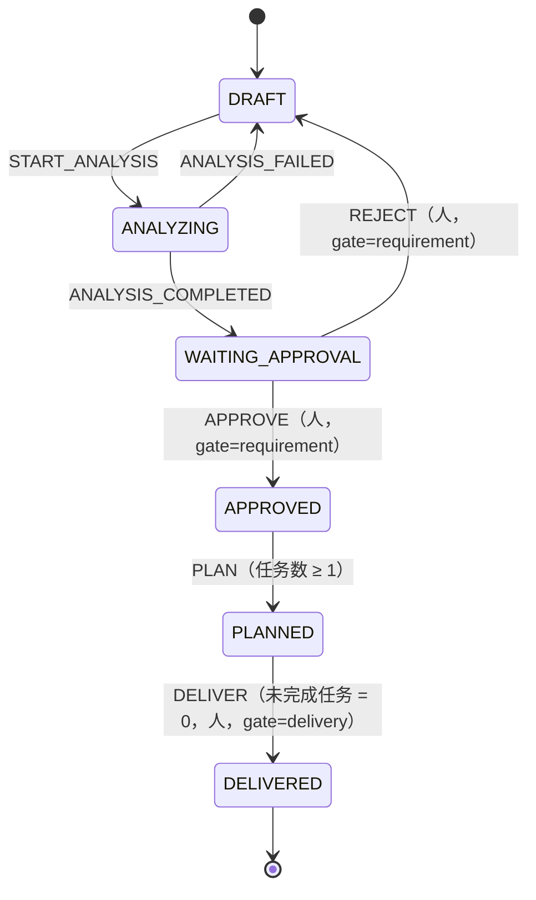
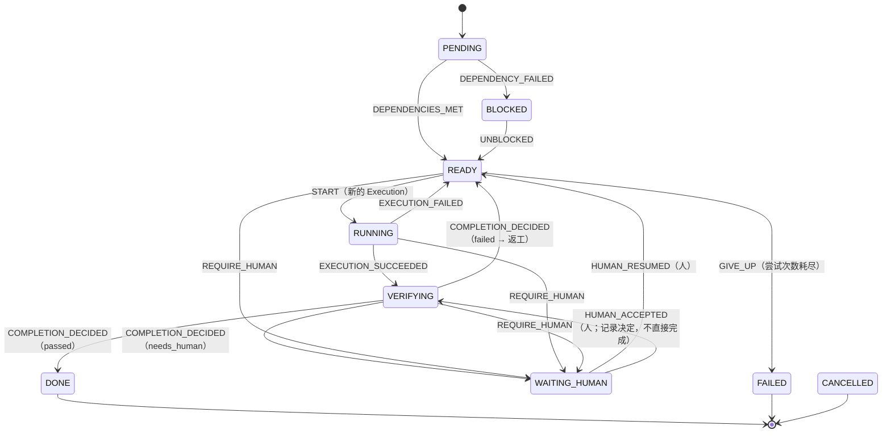
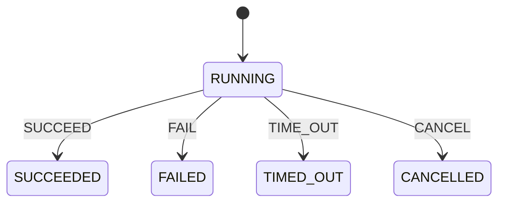

# 状态机（Stage 0）

代码：`packages/domain/src/state-machines/`。测试：`packages/domain/spec/`。

## 通用规则

- **唯一入口**：每种状态只能通过一个迁移函数计算：`transitionRequirement()`、`transitionTask()`、`transitionExecution()`。实体级的 `applyRequirementEvent()`、`applyTaskEvent()`、`applyExecutionEvent()` 在此基础上返回新实体。其他代码不得直接给 `status` 赋值（字段为 `readonly`）。
- **事件驱动**：迁移由带 `type` 的事件触发，而不是由“目标状态”触发。事件可以携带载荷，例如审批记录或完成判定。
- **非法即报错**：表中没有的组合抛出 `IllegalTransitionError`（包含 `machine`、`from`、`event`）；表中有、但载荷违反不变量的，抛出 `InvariantViolationError`。
- **表即文档**：迁移表在 `createMachine()` 中以数据形式声明。测试对“每个状态 × 每种事件”逐一核对，与下面的表一致。
- **持久化**：每次迁移在同一事务中写入状态和一条 `<entity>.transitioned` 事件（见 `persistence.md`）。

## Requirement

| 从 | 事件 | 到 | 守卫 |
| --- | --- | --- | --- |
| `DRAFT` | `START_ANALYSIS` | `ANALYZING` | — |
| `ANALYZING` | `ANALYSIS_COMPLETED` | `WAITING_APPROVAL` | 同时保存结构化分析 |
| `ANALYZING` | `ANALYSIS_FAILED` | `DRAFT` | — |
| `WAITING_APPROVAL` | `APPROVE` | `APPROVED` | 人类决定的 `approved` 审批，门为 `requirement`，对象为本需求 |
| `WAITING_APPROVAL` | `REJECT` | `DRAFT` | 人类决定的 `rejected` 审批 |
| `APPROVED` | `PLAN` | `PLANNED` | `taskCount ≥ 1` |
| `PLANNED` | `DELIVER` | `DELIVERED` | `openTaskCount = 0`，且人类批准，门为 `delivery`（Gate 2） |

## Task

所有非终态（`PENDING`、`READY`、`RUNNING`、`VERIFYING`、`WAITING_HUMAN`、`BLOCKED`）都接受 `CANCEL` 并进入 `CANCELLED`。终态为 `DONE`、`FAILED`、`CANCELLED`。

| 从 | 允许的事件 → 目标 |
| --- | --- |
| `PENDING` | `DEPENDENCIES_MET` → `READY`；`DEPENDENCY_FAILED` → `BLOCKED`；`CANCEL` → `CANCELLED` |
| `READY` | `START` → `RUNNING`；`REQUIRE_HUMAN` → `WAITING_HUMAN`；`GIVE_UP` → `FAILED`；`CANCEL` |
| `RUNNING` | `EXECUTION_SUCCEEDED` → `VERIFYING`；`EXECUTION_FAILED` → `READY`；`REQUIRE_HUMAN`；`CANCEL` |
| `VERIFYING` | `COMPLETION_DECIDED` → `DONE` / `READY` / `WAITING_HUMAN`；`REQUIRE_HUMAN`；`CANCEL` |
| `WAITING_HUMAN` | `HUMAN_RESUMED` → `READY`（门 `task_resume` 或 `task_start`）；`HUMAN_ACCEPTED` → `VERIFYING`（门 `task_acceptance`；人工验收只记录决定并重新进入完成判定，**不**直接 `DONE`）；`CANCEL` |
| `BLOCKED` | `UNBLOCKED` → `READY`；`CANCEL` |

### 完成规则（Evidence-based Done）

`VERIFYING → DONE` 只有一条路：`COMPLETION_DECIDED`，其载荷是 `evaluateCompletion()` 返回的 `CompletionDecision`。这个类型带有私有品牌，在类型检查下只能由该函数产生；想伪造必须写 `as unknown as`，代码评审应当拒绝。即使被伪造，状态机也拒绝不引用任何证据的“通过”判定。

`evaluateCompletion()` 失败即拒绝（fail closed）：

| 情况 | 结果 |
| --- | --- |
| 所需机器检查全部 `pass`（`source: machine`，同一 commit），AI 审查 `pass`，按需有人类批准 | `passed` |
| 任一机器检查 `fail`，或 AI 审查 `fail` | `failed`（回到 `READY` 返工） |
| 证据缺失、`error`、`skipped`、针对旧 commit、由 Agent 自报（`source: ai` 的机器检查）、没有 commit、什么都没配置 | `needs_human`（进入 `WAITING_HUMAN`） |

### 重试、返工与升级不是状态

- **重试**：`RUNNING --EXECUTION_FAILED--> READY --START--> RUNNING`，每次 `START` 对应一条新的 Execution（`kind: retry`）。
- **返工**：`VERIFYING --COMPLETION_DECIDED(failed)--> READY`，下一条 Execution 的 `kind` 为 `repair`。办公室的 Repair Bay 由 Execution 类型驱动，而不是由任务状态驱动。
- **升级**：换哪个执行器由 `ExecutionPolicy` 决定（`escalateAfterFailures`），体现在 Execution 的 `executorId` 上。
- **放弃**：策略判断尝试次数耗尽时发出 `GIVE_UP`。

## Execution

Execution 创建时直接处于 `RUNNING`，其余状态都是终态。执行器适配器的结果通过 `toExecutionEvent()`（`packages/executors`）映射为这里的事件。

## 相对任务书提案的调整

| 调整 | 原因 |
| --- | --- |
| 新增 Requirement `ANALYZING → DRAFT`（`ANALYSIS_FAILED`） | 否则分析失败（执行器崩溃、超时）会让需求永远停在 `ANALYZING`，与“重启恢复”目标矛盾 |
| 新增 Task `PENDING → CANCELLED` | 需求在任务开始前被撤回时，未开始的任务必须能够终结；其他非终态都允许取消，`PENDING` 不应例外 |
| `VERIFYING` 的三个出口合并为一个事件 `COMPLETION_DECIDED` | 去向由证据判定的结果决定，而不是由调用方选择，从而保证 `DONE` 只能来自证据 |
| `HUMAN_RESUMED` / `HUMAN_ACCEPTED` 需要审批记录 | 落实“Agent 不能作为最终审批人” |
| `HUMAN_ACCEPTED` 的目标由 `DONE` 改为 `VERIFYING`（架构评审修正） | 原设计让人工验收绕过 `evaluateCompletion()` / `CompletionDecision`，违反“`DONE` 只有一条、由证据决定的路径”。现在流程是：`WAITING_HUMAN` → 记录人的决定 → 记录人工 Evidence（`kind: approval`、`source: human`、当前 commit）→ `VERIFYING` → `COMPLETION_DECIDED` → `DONE`。人的权威保留（Agent 不能验收；需要人工批准的任务其 `CompletionPolicy.requireHumanApproval = true`），但不存在未被记录的完成旁路 |

以上调整都不改变 ADR-001 的方向。

## 已知的开放问题

- 需求撤回：需要一个 `WITHDRAWN` 终态，并级联取消其下所有任务。留待 Stage 2 与 Requirement Engine 一起设计。
- `FAILED` 任务的人工复活：目前是终态；如需复活，应新建任务而不是改写历史。
