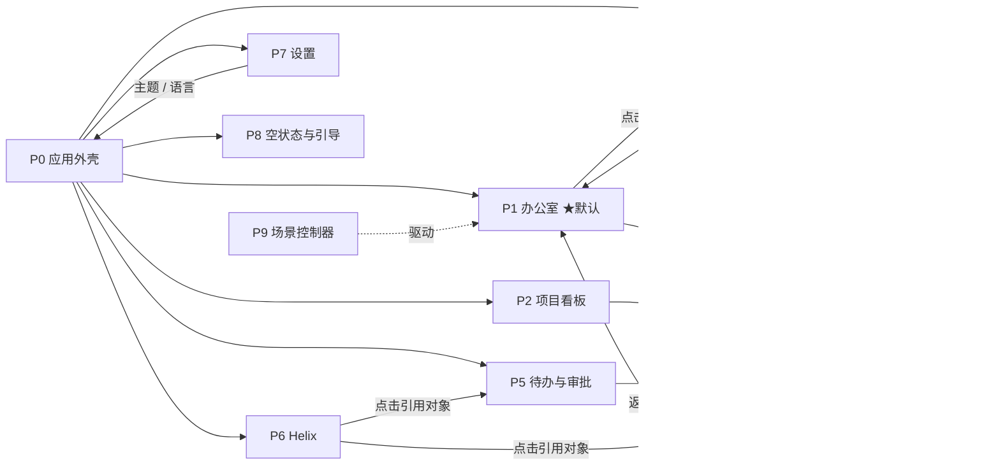

# UI 原型契约 V2（UI Prototype Contract V2）

- 产品：**Virtual AI Office / 智序工场**
- 状态：**契约冻结稿（仅文档）**；本文件规定“未来的可交互原型必须满足什么”，不实现任何界面
- 上游：`VISUAL_IDENTITY_V2.md`、`CHARACTER_SYSTEM_V1.md`；领域语义：`state-machines.md`、`human-channels.md`、`domain-model.md`

## 1. 原则

1. **原型必须是可交互、由场景驱动的，不接受只有一张静态首页。** 它要能演示：项目切换、角色 / 成员选择、任务选择、状态变化、Helix 交互、Waiting Human、评审、证据、完成。
2. **所有视觉变化来自一条场景事件。** 原型内置一个**确定性场景脚本**（§9）和一个可见的**事件日志**；不允许有无来源的装饰动画（与“办公室状态来自真实数据”的原则一致）。
3. **原型不假装是真实运行时，并且清楚区分“模拟的夹具行为”与“已实现的运行时能力”**（§9.1）。 它使用虚构的示例数据，界面上有明确的“原型 / Prototype”标记；不连接任何后端、不调用任何模型。
4. **状态词汇与 Stage 0 一致**：任务 `PENDING / READY / RUNNING / VERIFYING / WAITING_HUMAN / BLOCKED / DONE / FAILED / CANCELLED`；执行 `RUNNING / SUCCEEDED / FAILED / TIMED_OUT / CANCELLED`；审批与 `HumanActionRequest`（`OPEN / DELIVERED / RESPONDED / EXPIRED / CANCELLED`）。**“完成”只能经证据判定：接受 → `VERIFYING` → 证据通过 → `DONE`，不能直接 `DONE`。**
5. 默认主题 **智序 · Core**；“经典主题 / Classic Themes”可在设置里切换；默认界面与默认截图**不得**出现旧品牌与旧人设。
6. 默认语言中文，可切换英文（所有可见文案都有中英文）。

## 2. 页面清单（PAGE LIST）

| ID | 页面 | 说明 | 默认入口 |
| --- | --- | --- | --- |
| P0 | **应用外壳（App Shell）** | 全局栏 + 组织轨 + 内容区 + 协调器面板；所有页面共用 | — |
| P1 | **办公室（Office）** | 默认页：办公室画布 + 协调器面板 | ✔ 默认 |
| P2 | **项目看板（Project Dashboard）** | 当前项目的任务列表 / 泳道（按状态）、里程碑、阻塞与等待项、证据汇总 | 组织轨 → 项目 |
| P3 | **任务详情（Task Detail）** | 抽屉（桌面）/ 整页（移动）：描述、状态时间线、Execution 列表（含重试）、证据、评审、依赖、事件 | 点击任务卡 / 列表项 |
| P4 | **成员与角色（Members & Roles）** | 角色目录、人类成员、AI 成员；RoleBinding 视图（成员 × 项目 × 角色）；通道状态 | 组织轨 → 角色 / 成员 |
| P5 | **待办与审批（Waiting Human）** | 当前用户的 `HumanActionRequest` 与 Approval 收件箱 | 全局栏“Waiting Human” |
| P6 | **Helix（全屏视图）** | 对话、编排状态、重要决定、最近活动（桌面上以右侧面板形式常驻，窄屏时为独立页） | 协调器面板“展开” |
| P7 | **设置（Settings）** | 主题（智序 · Core / 经典主题）、语言、减少动效、密度、通知偏好 | 全局栏“设置” |
| P8 | **空状态与引导（Onboarding / Empty）** | 无 Workspace / 无项目 / 无成员时的引导；首次使用引导 | 首次进入 |
| P9 | **场景控制器（Prototype Scenario Controller）** | 仅原型有：步进 / 重置 / 速度 / 跳转到步骤；不属于产品 | 右下浮层（可隐藏） |

## 3. 外壳布局（P0）与四个区域

### 3.1 区域

| 区域 | 内容 | 桌面尺寸（≥ 1280 px） |
| --- | --- | --- |
| **A. 全局栏（Global Bar）** | `智序工场` 字标 + `Virtual AI Office`；Workspace 选择；Project 选择；运行时状态（已连接 / 离线 / 降级）；**Waiting Human 计数徽章**（点击进入 P5）；通知；设置 | 高 56 px，全宽 |
| **B. 组织轨（Organization Rail）** | Workspace → Project 列表 → Roles → Human Members → AI Agents（分组可折叠）；每项带状态点与徽章 | 宽 248 px（可折叠为 64 px 图标轨） |
| **C. 办公室画布（Office Canvas）** | §4 | 弹性宽度；最小 480 px |
| **D. 协调器面板（Coordinator Panel）** | 见 §3.2 | 宽 360 px（可拖拽 320–440 px） |

### 3.2 协调器面板（D）

面板区域在本文中沿用结构性名称“协调器面板（Coordinator Panel）”，但**面板里的可见名称是 Helix**（不出现“Helix”，不出现“傻妞”，不以模型命名）。包含五块，自上而下：

1. **标题区**：Helix 形象（小）+ 名称 `Helix` + 副标题 `System Orchestrator`（中文界面：`系统编排中枢`）+ 当前状态：**Planning / Dispatching / Waiting Human / Reviewing / Completed**（另有 Idle / Blocked / Offline，见 `CHARACTER_SYSTEM_V1.md` §3.1）；
2. **对话**：消息列表 + 输入框（`/` 聚焦）；消息类型：用户、Helix、系统；Helix 的回复**引用对象**（任务、角色、审批）并可点击跳转；
3. **当前编排状态**：当前项目的一行摘要（执行中 n / 等待 n / 阻塞 n / 完成 n）；
4. **重要决定与 Waiting Human**：待回复的请求卡片（琥珀色）、最近的重要决定；
5. **最近活动**：近期事件的时间线（可展开为完整事件日志）。

## 4. 办公室画布内容模型（C）

画布必须同时表示以下对象，且**每种对象都有固定的视觉编码**：

| 对象 | 视觉编码 |
| --- | --- |
| **Role** | 角色形象（`CHARACTER_SYSTEM_V1.md`）+ 角色铭牌 |
| **Member** | 铭牌上的徽章：人类 = 圆形 HUMAN；Agent = 六边形 AI；Agent 另有中性模型药丸 |
| **Task** | 工位上的任务卡：`TASK-ID`、标题（单行省略）、状态丝带、依赖数、证据数 |
| **Execution** | 任务卡上的进度脉冲 + 尝试芯片 `#1 / #2 重试`（`kind: retry / repair`） |
| **State** | 状态环 + 字形 + 工位效果（8 个座位状态）；任务丝带（9 个任务状态） |
| **Dependencies** | 任务卡之间的连线：实线 = 已满足；虚线 = 等待；**红色节点（✕）= 上游失败（BLOCKED）** |
| **Review** | Reviewer 到被评审任务的评审线 + 结论芯片（通过 / 需修改 / 缺少结论） |
| **Evidence** | 证据托盘芯片：build / test / review / human；✓ / ✕ / –；提交短哈希；过期证据灰显 |
| **Human Action** | 琥珀色标记：所需角色 + 成员 + “等待回复” + 已等待时长；点击打开响应面板 |

附加要求：

- **区域（Zone）**：Planning、Build、Verify、Docs、Human；
- **图层开关**：依赖 / 评审 / 证据 / Human Action；
- **图例**：状态与徽章图例，一键显示；
- **选中联动**：选中座位 / 任务卡 / 组织轨成员，三处同步高亮；
- **缩放与平移**：50%–200%，鼠标滚轮 / 双指缩放，拖动平移，“适应窗口”按钮；
- **空座位**：无成员的角色显示灰色空工位 +“无人负责”。

## 5. 状态清单（STATE LIST）

### 5.1 座位状态（8）

`IDLE`、`THINKING`、`WORKING`、`REVIEWING`、`WAITING_HUMAN`、`BLOCKED`、`DONE`、`OFFLINE`（视觉定义见 `CHARACTER_SYSTEM_V1.md` §6，原型必须**全部**可被演示）。

### 5.2 任务状态（9）与任务卡表现

| 任务状态 | 任务卡丝带 | 说明 |
| --- | --- | --- |
| `PENDING` | 灰色“排队（依赖未满足）” | 虚线依赖 |
| `READY` | 蓝灰“就绪” | 可被执行 |
| `RUNNING` | 蓝色“进行中”+ 进度脉冲 | |
| `VERIFYING` | 紫色“验证中” | 评审 / 测试进行中 |
| `WAITING_HUMAN` | 琥珀色“等你” | 有未终结的 `HumanActionRequest` |
| `BLOCKED` | 红色“阻塞”+ 红色依赖节点 | |
| `DONE` | 绿色“完成”+ 证据角标 | 只能经证据判定到达 |
| `FAILED` | 红色实心 ✕“失败”+ 重试标签 | |
| `CANCELLED` | 灰色划线“已取消” | |

### 5.3 其它状态

- **审批 / HumanActionRequest**：`OPEN`、`DELIVERED`、`RESPONDED`、`EXPIRED`、`CANCELLED`；
- **运行时 / 系统**：加载中、已连接、离线、降级、错误（带重试）、无数据（空状态）；
- **成员通道**（人类）：已验证、`unreachable`、未绑定（对应 `MemberChannel`）。

## 6. 交互清单（INTERACTION LIST）

“必须演示”列标记为 **M** 的交互，原型必须可操作。

| ID | 交互 | 描述 | 必须演示 |
| --- | --- | --- | --- |
| I-01 | **项目切换** | 全局栏 / 组织轨切换项目，画布、看板、Helix 上下文同步更换（至少 2 个项目：Demo Project A、Demo Project B） | **M** |
| I-02 | **Workspace 切换** | 全局栏切换 Workspace（原型提供 1 个主 Workspace + 1 个空 Workspace 用于演示空状态） | **M** |
| I-03 | **选择角色 / 座位** | 点击座位：右侧显示角色详情（成员、状态、当前任务、模型徽章） | **M** |
| I-04 | **选择成员** | 在组织轨点击人类 / AI 成员：画布聚焦其座位，联动高亮 | **M** |
| I-05 | **选择任务** | 点击任务卡或看板项：打开 P3 抽屉；画布高亮其依赖链 | **M** |
| I-06 | **状态变化演示** | 通过场景控制器步进，座位 / 任务状态按 §9 脚本变化，事件日志同步追加 | **M** |
| I-07 | **Helix 对话** | 在输入框发送消息，Helix 给出**脚本化**回复，并可点击回复里的对象跳转 | **M** |
| I-08 | **Waiting Human 响应** | 点击琥珀色标记 / P5 条目：对 `HumanActionRequest` 做 **通过 / 拒绝 / 接受 / 退回返工 / 无法承接 / 评论** | **M** |
| I-09 | **评审** | 查看评审线与结论；“需修改”触发返工并回到执行；“缺少结论”显示为失败评审而非通过 | **M** |
| I-10 | **证据** | 展开证据托盘与 P3 证据页；点击芯片查看来源、提交短哈希、是否过期 | **M** |
| I-11 | **完成** | 展示“接受 → VERIFYING → 证据通过 → DONE”完整路径；没有证据时不能完成 | **M** |
| I-12 | 图层开关 | 依赖 / 评审 / 证据 / Human Action 单独开关 | |
| I-13 | 画布缩放 / 平移 / 适应窗口 | 滚轮 / 触控缩放，拖动平移 | |
| I-14 | 主题切换 | 智序 · Core ↔ 经典主题（至少切换到 1 套经典主题并返回）；深 / 浅色 | |
| I-15 | 语言切换 | 中文 ↔ English | |
| I-16 | 减少动效 | 开关；也跟随系统 `prefers-reduced-motion` | |
| I-17 | 过滤与搜索 | 看板按状态 / 角色 / 成员过滤；全局搜索任务 ID | |
| I-18 | 键盘导航 | `J/K` 移动选择、`Enter` 打开、`Esc` 关闭、`/` 聚焦 Helix、`G` 然后 `O/D/M/A` 跳转 到办公室 / 看板 / 成员 / 审批、`?` 显示快捷键 | |
| I-19 | 场景控制 | 步进 / 后退 / 重置 / 速度（0.5×、1×、2×）/ 跳转到步骤 | **M**（原型内部） |
| I-20 | 敏感动作确认 | 对被架构标记为敏感的审批动作展示二次确认；对不允许在当前界面完成的动作显示“请在指定界面完成”。**哪些动作敏感 / 受限由架构定义，原型只演示交互形态** | |

## 7. 导航关系（NAVIGATION RELATIONSHIPS）

规则：

- 任意页面都可通过全局栏回到 P1；
- 项目切换保持“当前页面类型”（在看板页切换项目仍停在看板页）；
- 深链接：`#/project/<id>/task/<id>` 直接定位到任务详情并在画布上高亮；
- 返回键行为符合浏览器历史；抽屉关闭回到触发处。

## 8. 响应式行为（RESPONSIVE BEHAVIOR）

| 宽度 | 布局 |
| --- | --- |
| **大屏 ≥ 1920**（含“大屏办公室模式”） | 画布占主体；组织轨默认折叠为图标轨；协调器面板可收起为“信息条”；字号 +2 级；状态与任务卡更大；**隐藏所有悬停才可见的信息**，改为常显；适合展示墙（只读展示模式：自动轮播项目，无需输入） |
| **桌面 1280–1919** | A + B + C + D 四区同时可见 |
| **平板 768–1279** | 组织轨折叠为图标轨（点击展开浮层）；Helix 变为右侧抽屉（按钮唤起）；画布全宽 |
| **触屏模式**（任何宽度，检测到触控或手动开启） | 点击目标 ≥ 44 px；不依赖悬停（工具提示改为点击 / 长按）；手势：双指缩放、单指平移、长按显示详情；底部操作条 |
| **手机 < 768** | 底部导航：**办公室 / 任务 / Helix / 审批**；画布降级为**简化视图**（座位网格 + 缩略依赖图，可进入全画布）；任务详情为整页；Helix 为整页 |

画布性能预算：至少支持 **12 个座位 + 40 张任务卡 + 80 条边**，在中端笔记本上保持 ≥ 50 fps（循环动效除外）；超出规模时自动降级为聚合视图（按区域折叠）。

## 9. 场景脚本（SCENARIO，确定性）

原型内置**一个**完整场景，步骤固定，可重复运行。夹具为**中性的、基于角色的示例数据**（适合公开的开源仓库），**不使用任何真实人名**：

- **Workspace**：`Demo Workspace`；**项目**：`Demo Project A`（需求“地址搜索 V1”）、`Demo Project B`（用于项目切换）；
- **人类成员**：`Workspace Owner`（所有者）、`Product Manager`（产品经理）、`Human Approver`（用于重新路由的第二位授权人类成员）；
- **Agent 座位**：Architect（AI · Claude Sonnet）、Frontend Engineer（AI · Codex）、Backend Engineer ×2（AI · Codex；AI · DeepSeek，用于演示同角色多成员）、QA Engineer（AI · Codex）、Reviewer（AI · Claude Sonnet）、Documentation Specialist（AI · DeepSeek）；
- **Helix**（System Orchestrator）居中；
- Workspace Owner 不在 8 个角色阵容内，使用“通用座位”（见 `CHARACTER_SYSTEM_V1.md` §3.9）；
- **审批授权**一律写作“**该审批门的授权人类成员**”。夹具里如需展示具体权限名，必须标注为：**ILLUSTRATIVE FIXTURE — NOT ARCHITECTURE CONTRACT**（本文档不冻结任何权限词汇；权限模型由架构阶段定义）；
- **模型徽章会随场景变化**（例如把 Frontend Engineer 的模型从 Codex 换成 DeepSeek），**角色形象不变**，用来演示 Role ≠ Model。

| 步 | 事件 | 视觉结果 | 演示的要求 |
| --- | --- | --- | --- |
| S01 | 选中 Demo Project A；Helix Idle | 画布加载 Demo Project A；全部座位 IDLE；Helix 面板显示摘要 | I-01 |
| S02 | Workspace Owner 对 Helix 说“做一个地址搜索 V1” | 用户消息出现；`HELIX · Planning`（三节点依次点亮） | I-07 |
| S03 | Helix 给出计划：TASK-210…TASK-216 + 依赖 | 画布出现任务卡（`PENDING` / `READY`）与依赖边（虚线）；Helix 回复引用任务，可点击 | I-05、I-07 |
| S04 | 需求分析完成，产生 **Gate 1 审批请求**，所需角色 = **Workspace Owner**（授权人类成员） | `WAITING HUMAN` 卡片：Required role = Workspace Owner，Action = Approve requirement，已等待计时；通用座位琥珀环；Waiting Human 计数 +1；P5 出现请求 | I-08、角色系统 §6.3 |
| S05 | Workspace Owner 在 P5 选择**评论**（“积分放到 V2”）后**通过** | 评论成为项目决定（Decision）并出现在 Helix“重要决定”；请求 RESPONDED；任务进入 `READY` | I-08 |
| S06 | 后端、前端并行 `RUNNING` | 两座位 WORKING（机架指示灯闪烁、屏幕滚动）；任务卡进度脉冲；QA 任务仍 `PENDING`（虚线） | I-06 |
| S07 | 后端第一次尝试**失败**，自动**重试 #2**（可演示换模型：Codex → DeepSeek 的角色不变） | 任务卡显示 `FAILED` 尝试 → `#2 重试` 芯片；后端座位仍是同一角色形象，模型药丸变化 | ROLE ≠ MODEL |
| S08 | 前端依赖的接口任务失败（演示一条依赖链断裂） | 前端任务 `BLOCKED`：**红色依赖节点 ✕**，座位 BLOCKED；Helix 提示原因 | I-06 |
| S09 | 后端重试成功，前端解除阻塞 | 红色节点消失，依赖边变实线；前端 WORKING | I-06 |
| S10 | 审查员评审：**需修改** → 返工 → 再评审**通过** | 审查员 REVIEWING，评审线接通；结论芯片“需修改”→ 返工 → “通过”；审查员的**缺少结论**分支可由“跳转到步骤”演示为失败评审 | I-09 |
| S11 | QA 运行测试：第一次**失败**（证据 ✕），修复后**通过**（证据 ✓，绑定当前提交短哈希，旧证据显示“过期”） | QA WORKING；证据托盘依次出现 ✕、过期、✓ | I-10 |
| S12 | 任务需要**人类验收**：对应任务验收的 `HumanActionRequest`，所需角色 = **Product Manager**，由 RoleBinding 解析出被分配的人类成员；该成员可选**接受**或**退回返工** | 座位 WAITING_HUMAN；`WAITING HUMAN` 卡片（Required role、Action、等待时间）；响应面板显示“接受 / 退回返工 / 无法承接 / 评论” | I-08 |
| S13 | 被分配的人类成员点击**接受** → 任务 `VERIFYING`；人类证据（绑定当前提交）+ 机器证据一起评估 | 任务卡变 VERIFYING（紫）；证据托盘出现“human ✓”；评估中 | I-11 |
| S14 | 证据通过 → `DONE`；若证据缺失 / 过期则回到 WAITING_HUMAN（可跳转演示） | 绿色 DONE + 证据角标；座位 DONE 6 秒后回 IDLE；**没有证据就不能 DONE** | I-11 |
| S15 | 文档专员完成文档；项目全部任务 DONE | Helix 给出总结（引用任务与证据）；看板里程碑完成 | 完成 |
| S16 | 分支 A：S12 改为被分配的人类成员选择**无法承接** | 任务保持 `WAITING_HUMAN`；请求按 RoleBinding 重新路由到该审批门的另一位授权人类成员（`Human Approver`）；declined 记录出现；**如果没有其他授权成员，则显示“无人负责”阻塞，而不是随意分配** | 无法承接 ≠ 退回返工 |
| S17 | 分支 B：S12 改为**退回返工**并填写理由 | 任务 `WAITING_HUMAN → READY`，理由记录并显示在任务时间线；再次执行 | 退回返工 |
| S18 | 分支 C：把某个 Agent 设为离线 | 座位 OFFLINE（虚线灰环 + 断电工位）；其任务被 Helix 重新分派 | OFFLINE |

### 9.1 夹具与能力标注：模拟 vs 已实现

原型是**模拟的**。它演示的概念在不同阶段有不同的实现状态，**界面上必须用一个常驻的“原型 · 模拟数据 / PROTOTYPE · SIMULATED DATA”标记**，并在对应功能处显示能力标签：

| 能力 | 标签 | 说明 |
| --- | --- | --- |
| 任务 / 执行 / 证据 / 审批的状态机与实体 | **架构已定义（Stage 0 类型与状态机已合并）** | 已有领域代码与测试；尚未接入产品运行时与界面 |
| Helix 对话与编排 | **Legacy 运行时有对应能力；新核心尚未实现** | 原型中为脚本化回复 |
| `HumanActionRequest`、角色 → RoleBinding → 人类成员的路由 | **架构已定义；计划于后续阶段实现** | 原型中为模拟 |
| 审批授权的具体权限词汇 | **未冻结（架构阶段定义）** | 原型只显示“授权人类成员”；任何具体权限名都标注 ILLUSTRATIVE FIXTURE — NOT ARCHITECTURE CONTRACT |
| 人类沟通渠道（含 Telegram） | **未实现（计划中）** | **原型不声称 Human Channels 已存在**，也不展示 Telegram 专有界面 |
| 办公室画布、角色形象、Core 主题 | **本原型设计目标，尚未实现** | 实现前不得作为已有产品能力宣传 |
| 重试 / 返工 / 阻塞 / 离线的行为 | **模拟** | 对应真实语义，但数据为夹具 |

场景数据以**一份确定性 JSON 夹具**表示（`workspace / projects / roles / members / roleBindings / tasks / executions / evidence / humanActionRequests / events`），字段与 Stage 0 实体命名一致；场景控制器按事件序号推进。**任何界面变化都对应夹具里的一个事件**，事件日志面板逐条显示。

## 10. 动画状态（ANIMATION STATES）

| 动画 | 触发 | 时长 / 周期 | 静态等价（减少动效） |
| --- | --- | --- | --- |
| 座位状态过渡 | 座位状态变化 | 200 ms | 直接切换 |
| THINKING 三节点 | THINKING | 1.6 s 循环 | 三节点同时半亮 |
| WORKING 亮弧 / 进度脉冲 | WORKING | 1.6 s 循环 | 实线环 + 进度条 |
| REVIEWING 评审线光点 | REVIEWING | 2.0 s 往返 | 评审线实线 |
| WAITING_HUMAN 外圈虚线 | WAITING_HUMAN | 2.4 s 循环 | 虚线静止 |
| BLOCKED 节点弹出 | 进入 BLOCKED | 200 ms 一次 | 直接显示 |
| DONE 打勾描边 | 进入 DONE | 320 ms 一次；6 s 后座位回 IDLE | 直接显示 |
| Helix 连线流点 | Helix 下发 / 回传 | 1.6 s 循环（仅在有下发时） | 连线实线 |
| 任务卡出现 / 移除 | 计划生成 / 取消 | 200 ms | 直接切换 |
| 面板展开 / 抽屉 | 用户操作 | 200 ms | 直接切换 |
| 相机缩放 / 聚焦 | 选中 / 适应窗口 | 320 ms | 直接切换 |

规则：循环动效**只在其状态存在期间运行**；页面不可见（标签页后台）时暂停；`prefers-reduced-motion` 或设置里“减少动效”开启时，所有动画使用静态等价；动画**不得**用于没有对应事件的装饰。

## 11. 可访问性与国际化要求

- 对比度与非颜色编码遵循 `VISUAL_IDENTITY_V2.md` §5.6；
- 画布对象可由键盘遍历（`Tab` 进入画布后用方向键 / `J/K` 在座位与任务卡之间移动），并有屏幕阅读器标签；
- 画布提供**等价的非图形视图**（P2 看板 + 成员列表），保证无法使用画布的用户可完成全部流程；
- 所有可见文案有中文与英文；时间与数字按语言环境格式化；
- 触屏模式与大屏模式不削减功能（大屏展示模式为只读，除外）。

## 12. 验收标准（ACCEPTANCE CRITERIA）

**未满足以下任一项，原型不得被接受。**

### 12.1 总则

1. **不是静态首页**：原型包含 P0–P9（P9 仅原型内）并且 §6 标记 **M** 的交互**全部可操作**。
2. 场景 S01–S15 可以从头到尾**确定性地**跑通；S16–S18 三个分支可以通过场景控制器触发；重置后可重复。
3. 每一个视觉变化都能在**事件日志**里找到对应事件；不存在无来源的装饰动画。

### 12.2 必须演示

4. **Workspace 与项目切换**：Workspace 切换（含空 Workspace 空状态）与 Demo Project A ↔ Demo Project B，画布 / 看板 / Helix 同步变化。
5. **角色 / 成员选择**：座位、组织轨、右侧详情三处联动。
6. **任务选择**：任务卡 / 看板 / 详情抽屉联动，并高亮依赖链。
7. **状态变化**：8 个座位状态与 9 个任务状态**全部**至少出现一次；每个状态都有文字等价与静态等价。
8. **Helix 交互**：发送消息、收到脚本化回复、点击回复中的对象跳转。
9. **Waiting Human**：琥珀色标记、计数徽章、P5 收件箱、六种响应；“无法承接”与“退回返工”**行为不同**（前者任务保持 `WAITING_HUMAN` 并重新路由，后者 `WAITING_HUMAN → READY` 并记录理由）。
10. **评审**：评审线、结论芯片（通过 / 需修改 / 缺少结论），“缺少结论”显示为失败评审。
11. **证据**：证据托盘与详情；通过 / 失败 / 缺失；提交短哈希；过期证据灰显。
12. **完成**：接受 → `VERIFYING` → 证据通过 → `DONE`；没有证据不能 `DONE`。
12a. **阻塞与离线**：BLOCKED（红色依赖节点）与 OFFLINE（虚线灰环 + 断电工位）行为可演示，并说明恢复路径。
12b. **模拟标注**：界面常驻“原型 · 模拟数据”标记；§9.1 的能力标签齐全；**不声称** Human Channels（含 Telegram）已存在；不冻结任何权限词汇，具体权限名只允许出现在标注为“ILLUSTRATIVE FIXTURE — NOT ARCHITECTURE CONTRACT”的夹具里。
12c. **夹具中性**：夹具与界面文案**不含任何真实人名**，也不含真实项目名。

### 12.3 视觉与一致性

13. 默认主题为 **智序 · Core**；可切换到至少一套**经典主题**并返回；默认界面与默认截图**没有**“牛马工作室”“傻妞”、动漫角色或旧人设。
14. **ROLE ≠ MODEL**：场景 S07 中角色形象不变、仅模型药丸变化；全站没有以模型命名的角色形象。
15. 人类座位 = 圆形 HUMAN 徽章，Agent 座位 = 六边形 AI 徽章 + 中性模型药丸，在 48 px 下可区分。
16. 状态永不只靠颜色；对比度满足 `VISUAL_IDENTITY_V2.md` §5.1；`prefers-reduced-motion` 生效。
17. 全部可见文案有中英文；品牌名使用“智序工场 / Virtual AI Office”，编排身份使用 **Helix**（System Orchestrator / 系统编排中枢），不使用“办公室协调器”。

### 12.4 响应式与性能

18. 大屏 / 桌面 / 平板 / 触屏 / 手机五种布局都能完成 §6 的 M 交互（大屏展示模式除外）。
19. 满足画布性能预算（§8）；循环动效在页面隐藏时暂停。
20. 无网络也能运行（不依赖外部服务与外部字体）。

### 12.5 交付物

21. 一个**可直接打开**的原型（无需构建服务器即可演示，或附一条命令），加一份 **≤ 90 秒的演示录屏**，演示 §9 的 S01–S15；
22. 一份**覆盖矩阵**：§12.2 的每一项对应到原型里的具体位置与步骤；
23. 一份**文案清单**（中 / 英），供品牌守卫检查（不含旧品牌词）。

### 12.6 明确不接受的情形

- 只有静态首页或静态截图拼接；
- 动画与数据无关（无事件来源）；
- 把 Claude / Codex / DeepSeek 做成角色形象；
- 状态只用颜色区分；
- 默认外观沿用 Legacy 二次元视觉；
- 把“接受”直接做成 `DONE`（绕过证据）；
- 把原型描述成真实产品运行（缺少“原型”标记）。

## 13. 不在本契约范围内

后端、真实数据接入、Telegram、渲染技术选型、最终 logo 与插画（见 `VISUAL_IDENTITY_V2.md` §10）、对 Legacy 界面的任何修改。
